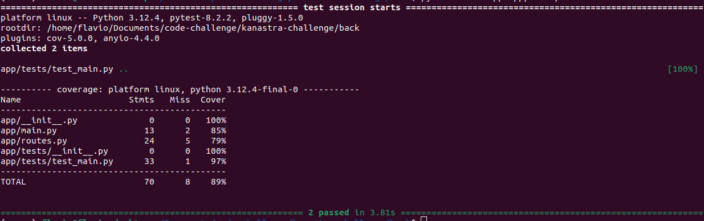
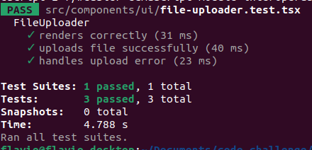

# Hiring Challenge (Soft. Engineers Fullstack)

https://github.com/Kanastra-Tech/kanastra-challenge-boilerplate

Eu fiz esse changlenge em dois dias, não deu para fazer tudo o que eu queria fazer,
mas acho que cobri os principais tópicos.

Eu adotei a seguinte linha de raciocínio: tem muita coisa para implementar, então vou tentar
implementar os principais pontos em detriemnto de outros. Por exemplo, ao invês
de salvar os dados em um banco eu optei por fazer algo mais simples, salvo diretamente no sistema de arquivos. Isso é ruim? Nôa, é péssimo, mas acredito que para o propósito do desafio está de bom tamnanho.

## Vamos começar discutindo a arquitetura?

Como a necessidade é ter um processamento em menos de 60s, eu utilizaria uma function/lambda 
apenas com o endpoint de processamento. Ela recebe o csv e envia para um tópico(fila).

No outro lado do tópico, poderia ter um subscriber para realizar o processamento.

Poderemos ter também um outro subscriber para gerar os boletos e disparar as mensagens.

Os demais endpoints poderiam estar em um aplicação dockerizada.

Poderíamos pensar em ter um BFF para orquestar as requisições necessárias e simplificar a
vida do front-end.

## Para rodar a aplicação

    docker-compose up --build

Acesse http://localhost:5000/

## Testes Unitários no back-end

## Testes unitários no fronet-end

## Teste de integração

Precisa definir uma abordagem. Daria para fazer desde um script semi-automatizado com Postman 
(sim dá para fazer), daria para fazer um repositŕoio apartado executando os endpoints 
(sem passar pelo front) e também daria para fazer um E2E com Selenium ou Cypress.

Daria até para simular os ambientes com Docker e rodar os testes nos containers.

Eu optei por fazer um [teste](integrated-tests) como se fosse um repositório apartado.

## UX

Um ponto que eu gostaria de ter implementado é "...melhore-os a fim de criar uma boa
experiência no frontend." Porém, antes de começar a melhorar componentes, a primeira coisa que eu faria seria validar o .csv. Mesmo que eu fosse mais um subscriber no tópico.

O tamanho do csv é gigante, imagina o usuário enviando um arquivo com alguns dados inadequados,
como faremos para dar esse feedback ao usuário?

Eu comecei a fazer um [validador csv](validador-csv) que logo se transformaria em um endpoint.
Seria inteligente, conversar com o PO para entender se essa é uma necessidade real (com valor agregado).
Inclusive, no caso positivo (validar o cvs), precisaremos discutir quais seriam as regras de validação?

## Conclusão

Isso foi o que deu para fazer em dois dias. Há diversos pontos de melhoria, vou listar os 
amis óbvios:

1. Acertar as variáveis de ambiente
2. Melhorar a interface
3. Implementar uma arqauitetura decente
4. Implementar load test
5. Melhorar os logs
6. Aplicar um lint
7. etc...